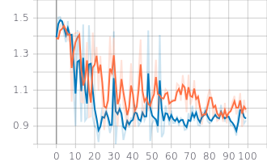
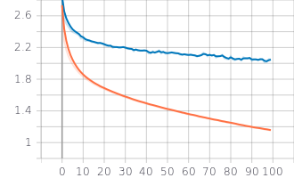
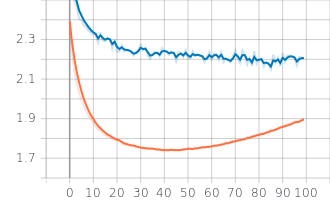

# Automatic Speech Recognition with DAgger
Seq2Seq Automatic Speech Recognition using DAgger (Scheduled Sampling) and Supervised Imitation Learning (Teacher Forcing).

The effect of Scheduled Sampling on RNN based sequence predicitin model was first studied in [1] S. Bengio, O. Vinyals, N. Jaitly, and N. Shazeer. Scheduled sampling for sequence prediction with recurrent neural networks. In Advances in Neural Information Processing Systems, pages 1171–1179, 2015.

It studied the performance of three systems: (1) Image captioning (2) Constituency Parsing (3) Speech Recognition. The speech recognition model was two layer LSTM for direct acoustic to HMM state (phoneme) prediction. The frames to HMM states alighnment and labeling was obtained using KALDI on TIMIT dataset. Note that this was not an encoder-decoder based model.

## First experiment:
(1) Dataset: A subset of the TIMIT dataset. No. of training samples ~ 1k. No of test samples ~ 500. 20 dimensional Mel features.\
(2) Model: Encoder-decoder model. Each was made of single layer of LSTM. No droput. Adam optimizer with default parameters. Vocab size = 30 (26 + \<PAD\>, ' ', \<SOS\>, \<EOS\>)\
(3) Experiment results:\
Character Error Rate (CER) vs. Epochs (evaluated on test set). Red = Teacher Forcing (beta=1), Blue = Scheduled Sampling (beta=0.75)\
\
Training Loss vs. Epochs: Red = Teacher Forcing (beta=1), Blue = Scheduled Sampling (beta=0.75)\
\
Test Loss vs. Epochs: Red = Teacher Forcing (beta=1), Blue = Scheduled Sampling (beta=0.75)\

## TIMIT dataset
The audio file to be used is the converted *.WAV.wav file.

For logging and visualization on TensorBoard:\
tensorboard --logdir runs\
http://localhost:6006\

## Gitting:
### Pusing changes:
git diff\
git status\
git add -A\
git commit -m "Added this and that"\
git pull origin master\
git push origin master
### Work on a new branch, commit to local, and push to remote
git branch -a\
git branch new_branch\
git checkout new_branch\
... Do something ...\
git status\
git diff\
git add -A\
git commit -m "Added this and that"\
git push -u origin new_branch
### Merge with the master branch
git checkout master\
git pull origin master\
git branch --merged\
git merge new_branch\
git push origin master\
git branch --merged
### Delete the new_branch
git branch -d new_branch\
git branch -a\
git push origin --delete new_branch
